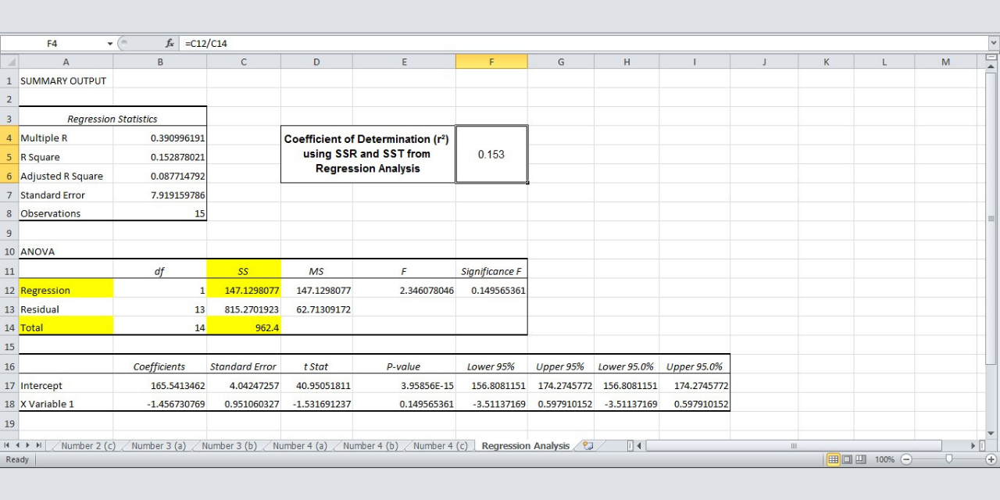

# Statistical Final Exam Study Cases using Microsoft Excel 
This is a final exam study cases of the Statistics, Problem-Solving, and Decision-Making course. In this examination, several cases are given related to statistical things including problem-solving and decision-making such as finding the value of Z (Z-value for the sampling distribution of the mean), making decisions using hypothesis testing, determine the value of covariance, visualizing the data using scatter plot, finding the regression line, and finding the coefficient of determination.

For the detail on what exactly the cases are and how I solved them, you may download and read the report that I have already attached.

